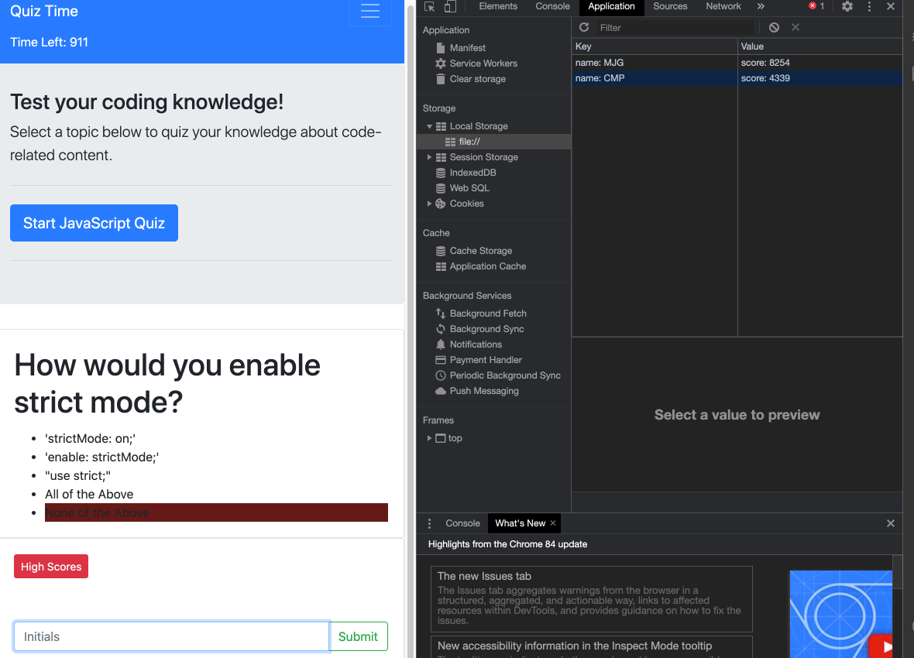

# Bootcamp-Week-4

##Screenshot of Website

## Link to Live

https://github.com/marcos-cmd/Code-Quiz

## GitHub URL

https://marcos-cmd.github.io/Code-Quiz/

## Functions of Code Quiz
1. Start button works
2. timer counts down
3. question title changes
4. question answer choices change
5. correct answers add time
6. incorrect answers decrease time
7. When submitting initials, it saves to Local Storage
